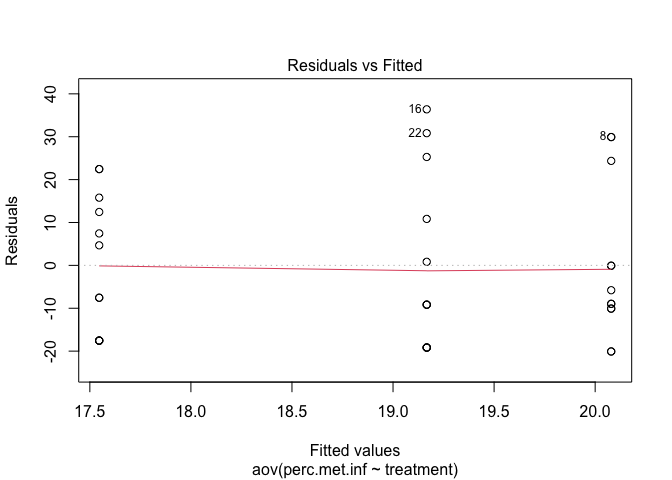

Fall 2022 Galleria field infection data
================
Morgan Swoboda
2023-02-13

# Package install and upload data sheet

``` r
#install.packages("emmeans")
#install.packages("ggthemes")

library(ggplot2)
library(emmeans)
library(tidyr)
library(dplyr)
```

    ## 
    ## Attaching package: 'dplyr'

    ## The following objects are masked from 'package:stats':
    ## 
    ##     filter, lag

    ## The following objects are masked from 'package:base':
    ## 
    ##     intersect, setdiff, setequal, union

``` r
library(ggthemes)
library(RColorBrewer)

#import data
Fall22EPF <- read.csv("Fall 22 epf bioassay - Sheet1 (1).csv", )

#make treatments and varieties into factors
Fall22EPF$treatment = factor(Fall22EPF$treatment, levels = c("Control", "10Met", "10Bb"))
Fall22EPF$variety = factor(Fall22EPF$variety, levels = c("Cochise", "Armani"))
#Fall22EPF$num.dead = as.numeric(Fall22EPF$num.dead)
#Fall22EPF$num.pupae = as.numeric(Fall22EPF$num.pupae)
#Fall22EPF$total.out = as.numeric(Fall22EPF$total.out)
#Fall22EPF$num.met.infect = as.numeric(Fall22EPF$num.met.infect)
```

# Prelim data check

``` r
#histogram of the distribution of number of metarhizium infected insects
hist(Fall22EPF$num.met.infect)
```

<!-- -->

``` r
#need to make a histogram of the residuals?

#proportion of met infected
ggplot(data = Fall22EPF, aes(x = treatment, y = prop.met.inf, color = variety)) + geom_boxplot() + 
  ggtitle("Proportion of Metarhizium infection")
```

<!-- -->

``` r
#number of met infected
ggplot(data = Fall22EPF, aes(x = treatment, y = prop.met.inf, color = variety)) + geom_boxplot() + 
  ggtitle("Number of Metarhizium infection")
```

<!-- -->

``` r
#the same graph basically, but that makes sense?
```

# Stats for Metarhizium - ANOVA

## This is how I’ve analyzed all the previous data

### Do I use the number of met infection, or the proportions?

``` r
attach(Fall22EPF)

##two way ANOVA
two.way.Met <- aov(perc.met.inf~treatment*variety)
summary(two.way.Met) #no signifcant differences, no interaction, change to one way model instead?
```

    ##                   Df Sum Sq Mean Sq F value Pr(>F)
    ## treatment          2     40    19.8   0.055  0.947
    ## variety            1    196   196.2   0.543  0.467
    ## treatment:variety  2    150    74.8   0.207  0.814
    ## Residuals         30  10831   361.0

``` r
summary.lm(two.way.Met)
```

    ## 
    ## Call:
    ## aov(formula = perc.met.inf ~ treatment * variety)
    ## 
    ## Residuals:
    ##    Min     1Q Median     3Q    Max 
    ## -24.07 -14.26  -7.46  13.87  41.30 
    ## 
    ## Coefficients:
    ##                              Estimate Std. Error t value Pr(>|t|)  
    ## (Intercept)                   20.1587     7.7571   2.599   0.0144 *
    ## treatment10Met                -5.8995    10.9702  -0.538   0.5947  
    ## treatment10Bb                 -4.7884    10.9702  -0.436   0.6656  
    ## varietyArmani                 -0.1587    10.9702  -0.014   0.9886  
    ## treatment10Met:varietyArmani   9.9735    15.5142   0.643   0.5252  
    ## treatment10Bb:varietyArmani    4.5106    15.5142   0.291   0.7733  
    ## ---
    ## Signif. codes:  0 '***' 0.001 '**' 0.01 '*' 0.05 '.' 0.1 ' ' 1
    ## 
    ## Residual standard error: 19 on 30 degrees of freedom
    ## Multiple R-squared:  0.03436,    Adjusted R-squared:  -0.1266 
    ## F-statistic: 0.2135 on 5 and 30 DF,  p-value: 0.9541

``` r
##one way anova
one.way.Met <- aov(perc.met.inf~treatment)
summary(one.way.Met) #not significant
```

    ##             Df Sum Sq Mean Sq F value Pr(>F)
    ## treatment    2     40    19.8   0.058  0.943
    ## Residuals   33  11177   338.7

``` r
summary.lm(one.way.Met)
```

    ## 
    ## Call:
    ## aov(formula = perc.met.inf ~ treatment)
    ## 
    ## Residuals:
    ##     Min      1Q  Median      3Q     Max 
    ## -20.079 -17.546  -7.546  13.287  36.389 
    ## 
    ## Coefficients:
    ##                Estimate Std. Error t value Pr(>|t|)    
    ## (Intercept)     20.0794     5.3127   3.780 0.000626 ***
    ## treatment10Met  -0.9127     7.5133  -0.121 0.904049    
    ## treatment10Bb   -2.5331     7.5133  -0.337 0.738142    
    ## ---
    ## Signif. codes:  0 '***' 0.001 '**' 0.01 '*' 0.05 '.' 0.1 ' ' 1
    ## 
    ## Residual standard error: 18.4 on 33 degrees of freedom
    ## Multiple R-squared:  0.003522,   Adjusted R-squared:  -0.05687 
    ## F-statistic: 0.05831 on 2 and 33 DF,  p-value: 0.9435

``` r
plot(one.way.Met) #probably not normal based on QQ plot, looks like it's exponential?
```

<!-- --><!-- --><!-- --><!-- -->

``` r
shapiro.test(resid(one.way.Met)) #residuals NOT normal
```

    ## 
    ##  Shapiro-Wilk normality test
    ## 
    ## data:  resid(one.way.Met)
    ## W = 0.88312, p-value = 0.001217

``` r
fligner.test(prop.met.inf~treatment) #normal
```

    ## 
    ##  Fligner-Killeen test of homogeneity of variances
    ## 
    ## data:  prop.met.inf by treatment
    ## Fligner-Killeen:med chi-squared = 0.5765, df = 2, p-value = 0.7496

``` r
#KW instead since it's not normal
##KW for met
MetF22KW <- kruskal.test(perc.met.inf~treatment)
print(MetF22KW) #not significant
```

    ## 
    ##  Kruskal-Wallis rank sum test
    ## 
    ## data:  perc.met.inf by treatment
    ## Kruskal-Wallis chi-squared = 0.35641, df = 2, p-value = 0.8368

``` r
#make some graphs
par(mfrow = c(1,2))
plot(treatment, num.met.infect, ylab = "number of met infected")
plot(treatment, perc.met.inf, ylab = "prop met infected")
```

<!-- -->

``` r
#nice plot
met.inf.F22 <- ggplot(data = Fall22EPF, aes(x = treatment, y = perc.met.inf, fill = treatment)) + 
  geom_bar(stat = "summary", fun = "mean", position = "dodge", color = "black") + 
  scale_fill_manual(values=c("#B31B1B", "#ddd3c2", "#221f1b")) +
  geom_errorbar(stat = "summary", fun.data = "mean_se", aes(x=treatment), position = "dodge", width = 0.5) + 
  ylab("Percent of G. mellonella infected by M. anisopliae") + 
  theme_classic() + theme(text = element_text(size=15)) + 
  theme(legend.position = "none") + ggtitle("Fall 2022")

#centered the title and made an object
met.inf.F22 <- met.inf.F22 + theme(plot.title = element_text(hjust = 0.5))
met.inf.F22
```

<!-- -->

# Try a different type of analysis? X is categorical, Y is discrete?

# Try a GLM?

## can use a GLM when the variance is not constant, and/or when the errors are not normally distributed

### Might consider using GLMs when the response variable is: count data expressed as proportions, count data that are not proportions, binary response variables, data on time to death where the varience increases faster than linearly with the mean

``` r
names(Fall22EPF) 
```

    ##  [1] "pot.ID"         "treatment"      "variety"        "block"         
    ##  [5] "num.dead"       "num.pupae"      "total.out"      "num.alive"     
    ##  [9] "num.tot.infect" "perc.out"       "num.bb.infect"  "num.met.infect"
    ## [13] "prop.met.inf"   "perc.met.inf"   "prop.bb.inf"    "perc.bb.inf"   
    ## [17] "perc.alive"     "corr.mor.met"

``` r
#num.dead is the number of galleria counted as dead, num.pupae is the number that pupated, total.out
#is the sum of num.dead and num.pupae, num.met.infect is the number of galleria that exhibited
#Metarhizium infections

#look at main effect means
tapply(prop.met.inf, treatment, mean)
```

    ##   Control     10Met      10Bb 
    ## 0.2007937 0.1916667 0.1754630

``` r
tapply(num.met.infect, treatment, mean)
```

    ##  Control    10Met     10Bb 
    ## 1.833333 1.833333 1.666667

``` r
tapply(prop.met.inf, variety, mean)
```

    ##   Cochise    Armani 
    ## 0.1659612 0.2126543

``` r
#check with error distribution works best with this data
library(MASS)
```

    ## 
    ## Attaching package: 'MASS'

    ## The following object is masked from 'package:dplyr':
    ## 
    ##     select

``` r
fit1 <- fitdistr(Fall22EPF$prop.met.inf, "normal")
fit2 <- fitdistr(Fall22EPF$num.met.infect, "Poisson")
fit3 <- fitdistr(Fall22EPF$prop.met.inf, "exponential")
fit4 <- fitdistr(Fall22EPF$num.met.infect, "negative binomial")

#check the AIC of the three error distributions
AIC(fit1, fit2, fit3, fit4) #the smaller the AIC, the better fit. 
```

    ##      df       AIC
    ## fit1  2 -18.71029
    ## fit2  1 134.54091
    ## fit3  1 -45.83545
    ## fit4  2 131.93405

``` r
#fit 1 and 3 have negative AICs?

#glm model of interactions between treatment and variety - Poisson error distribution
glmintmodel <- glm(num.met.infect ~ treatment * variety, poisson)
summary(glmintmodel) #no interaction
```

    ## 
    ## Call:
    ## glm(formula = num.met.infect ~ treatment * variety, family = poisson)
    ## 
    ## Deviance Residuals: 
    ##     Min       1Q   Median       3Q      Max  
    ## -2.1603  -1.6330  -0.6741   0.8386   2.4257  
    ## 
    ## Coefficients:
    ##                                Estimate Std. Error z value Pr(>|z|)  
    ## (Intercept)                   6.061e-01  3.015e-01   2.010   0.0444 *
    ## treatment10Met               -3.185e-01  4.646e-01  -0.685   0.4931  
    ## treatment10Bb                -2.007e-01  4.495e-01  -0.446   0.6553  
    ## varietyArmani                 3.024e-10  4.264e-01   0.000   1.0000  
    ## treatment10Met:varietyArmani  5.596e-01  6.150e-01   0.910   0.3628  
    ## treatment10Bb:varietyArmani   2.007e-01  6.195e-01   0.324   0.7460  
    ## ---
    ## Signif. codes:  0 '***' 0.001 '**' 0.01 '*' 0.05 '.' 0.1 ' ' 1
    ## 
    ## (Dispersion parameter for poisson family taken to be 1)
    ## 
    ##     Null deviance: 63.726  on 35  degrees of freedom
    ## Residual deviance: 61.742  on 30  degrees of freedom
    ## AIC: 142.56
    ## 
    ## Number of Fisher Scoring iterations: 5

``` r
#histogram of the residuals - looks like negative binomial
ggplot(data = Fall22EPF, aes(x = glmintmodel$residuals)) +
    geom_histogram(fill = 'steelblue', color = 'black') +
    labs(title = 'Histogram of Residuals', x = 'Residuals', y = 'Frequency')
```

    ## `stat_bin()` using `bins = 30`. Pick better value with `binwidth`.

<!-- -->

``` r
#glm model of interactions between treatment and variety - negative binomial
#error distribution
glmintmodel2 <- glm.nb(num.met.infect ~ treatment * variety) 
#using glm.nb() - A modification of the system function glm() to include estimation of the 
#additional parameter, theta, for a Negative Binomial generalized linear model.
summary(glmintmodel2) #no interaction
```

    ## 
    ## Call:
    ## glm.nb(formula = num.met.infect ~ treatment * variety, init.theta = 2.780118588, 
    ##     link = log)
    ## 
    ## Deviance Residuals: 
    ##     Min       1Q   Median       3Q      Max  
    ## -1.8407  -1.4759  -0.5421   0.6172   1.8168  
    ## 
    ## Coefficients:
    ##                                Estimate Std. Error z value Pr(>|z|)
    ## (Intercept)                   6.061e-01  3.884e-01   1.561    0.119
    ## treatment10Met               -3.185e-01  5.795e-01  -0.550    0.583
    ## treatment10Bb                -2.007e-01  5.674e-01  -0.354    0.724
    ## varietyArmani                 3.587e-17  5.493e-01   0.000    1.000
    ## treatment10Met:varietyArmani  5.596e-01  7.862e-01   0.712    0.477
    ## treatment10Bb:varietyArmani   2.007e-01  7.897e-01   0.254    0.799
    ## 
    ## (Dispersion parameter for Negative Binomial(2.7801) family taken to be 1)
    ## 
    ##     Null deviance: 42.959  on 35  degrees of freedom
    ## Residual deviance: 41.750  on 30  degrees of freedom
    ## AIC: 140.75
    ## 
    ## Number of Fisher Scoring iterations: 1
    ## 
    ## 
    ##               Theta:  2.78 
    ##           Std. Err.:  1.98 
    ## 
    ##  2 x log-likelihood:  -126.753

``` r
#histogram of the residuals
ggplot(data = Fall22EPF, aes(x = glmintmodel2$residuals)) +
    geom_histogram(fill = 'steelblue', color = 'black') +
    labs(title = 'Histogram of Residuals', x = 'Residuals', y = 'Frequency')
```

    ## `stat_bin()` using `bins = 30`. Pick better value with `binwidth`.

<!-- -->

``` r
#R reports two forms of deviance – the null deviance and the residual deviance. The null deviance
#shows how well the response variable is predicted by a model that includes only the intercept
#(grand mean). It’s a measure of badness of fit–higher numbers indicate worse fit.  As a general
#rule of thumb, you should hope that your Residual deviance is not more than twice your degrees of
#freedom.

#The Akaike Information Criterion (AIC) provides a method for assessing the quality of your model 
#through comparison of related models.  It’s based on the Deviance, but penalizes you for making the
#model more complicated.  Much like adjusted R-squared, it’s intent is to prevent you from including
#irrelevant predictors. However, unlike adjusted R-squared, the number itself is not meaningful. If
#you have more than one similar candidate models (where all of the variables of the simpler model
#occur in the more complex models), then you should select the model that has the smallest AIC. So
#it’s useful for comparing models, but isn’t interpretable on its own.

# not including interaction term 
nointmodel <-  glm(num.met.infect ~ treatment, poisson)
summary(nointmodel)
```

    ## 
    ## Call:
    ## glm(formula = num.met.infect ~ treatment, family = poisson)
    ## 
    ## Deviance Residuals: 
    ##     Min       1Q   Median       3Q      Max  
    ## -1.9148  -1.8257  -0.6162   0.9274   1.9235  
    ## 
    ## Coefficients:
    ##                  Estimate Std. Error z value Pr(>|z|)   
    ## (Intercept)     6.061e-01  2.132e-01   2.843  0.00447 **
    ## treatment10Met  1.118e-10  3.015e-01   0.000  1.00000   
    ## treatment10Bb  -9.531e-02  3.090e-01  -0.308  0.75771   
    ## ---
    ## Signif. codes:  0 '***' 0.001 '**' 0.01 '*' 0.05 '.' 0.1 ' ' 1
    ## 
    ## (Dispersion parameter for poisson family taken to be 1)
    ## 
    ##     Null deviance: 63.726  on 35  degrees of freedom
    ## Residual deviance: 63.600  on 33  degrees of freedom
    ## AIC: 138.41
    ## 
    ## Number of Fisher Scoring iterations: 5

``` r
#histogram of the residuals
ggplot(data = Fall22EPF, aes(x = nointmodel$residuals)) +
    geom_histogram(fill = 'steelblue', color = 'black') +
    labs(title = 'Histogram of Residuals', x = 'Residuals', y = 'Frequency')
```

    ## `stat_bin()` using `bins = 30`. Pick better value with `binwidth`.

<!-- -->

``` r
#see how the models compare to each other using an anova
anova(glmintmodel,glmintmodel2,nointmodel, test = "Chi") #not significantly different, so we're ok using the model2?
```

    ## Analysis of Deviance Table
    ## 
    ## Model 1: num.met.infect ~ treatment * variety
    ## Model 2: num.met.infect ~ treatment * variety
    ## Model 3: num.met.infect ~ treatment
    ##   Resid. Df Resid. Dev Df Deviance Pr(>Chi)    
    ## 1        30     61.742                         
    ## 2        30     41.750  0   19.992             
    ## 3        33     63.600 -3  -21.850 7.01e-05 ***
    ## ---
    ## Signif. codes:  0 '***' 0.001 '**' 0.01 '*' 0.05 '.' 0.1 ' ' 1

``` r
# Ashley suggested to keep the variety interaction even though it's not significant
#the model2 doesn't seem like a good fit

#try again without the last model
anova(glmintmodel,glmintmodel2, test = "Chi")
```

    ## Analysis of Deviance Table
    ## 
    ## Model 1: num.met.infect ~ treatment * variety
    ## Model 2: num.met.infect ~ treatment * variety
    ##   Resid. Df Resid. Dev Df Deviance Pr(>Chi)
    ## 1        30     61.742                     
    ## 2        30     41.750  0   19.992

``` r
#install.packages("rcompanion") #this package is needed for the compareGLM function to compare model fits
library(rcompanion)
compareGLM(glmintmodel, glmintmodel2) #neg binomial still looks the best?
```

    ## $Models
    ##   Formula                               
    ## 1 "num.met.infect ~ treatment * variety"
    ## 2 "num.met.infect ~ treatment * variety"
    ## 
    ## $Fit.criteria
    ##   Rank Df.res   AIC  AICc   BIC McFadden Cox.and.Snell Nagelkerke p.value
    ## 1    6     30 144.6 148.6 155.6 0.014970       0.05362    0.05500 0.13780
    ## 2    6     30 140.8 144.8 151.8 0.009234       0.03228    0.03323 0.09655

``` r
#not using this code below
#test the model that you think fits best with the Hosmer Lemeshow goodness of fit test.
# install.packages("ResourceSelection") #need this package for the hoslem.test() function.
#library(ResourceSelection)
#hoslem.test(Fall22EPF$num.met.infect, fitted(model2))
```

# Now that we know the Negative Binomial error distribution is probably the pest fit, analyze the data

``` r
#Using a Chi Squared bc proportions
met.inf.anova <- anova(glmintmodel2, test = "Chisq") #running the chi sqaured test
```

    ## Warning in anova.negbin(glmintmodel2, test = "Chisq"): tests made without
    ## re-estimating 'theta'

``` r
met.inf.anova #no signficant differences
```

    ## Analysis of Deviance Table
    ## 
    ## Model: Negative Binomial(2.7801), link: log
    ## 
    ## Response: num.met.infect
    ## 
    ## Terms added sequentially (first to last)
    ## 
    ## 
    ##                   Df Deviance Resid. Df Resid. Dev Pr(>Chi)
    ## NULL                                 35     42.959         
    ## treatment          2  0.07741        33     42.881   0.9620
    ## variety            1  0.61056        32     42.271   0.4346
    ## treatment:variety  2  0.52053        30     41.750   0.7708

``` r
emmeans::emmeans(glmintmodel2, pairwise~treatment, type="response") #looking at mean comparisons, no signficant differences
```

    ## NOTE: Results may be misleading due to involvement in interactions

    ## $emmeans
    ##  treatment response    SE  df asymp.LCL asymp.UCL
    ##  Control       1.83 0.504 Inf     1.070      3.14
    ##  10Met         1.76 0.496 Inf     1.016      3.06
    ##  10Bb          1.66 0.470 Inf     0.951      2.89
    ## 
    ## Results are averaged over the levels of: variety 
    ## Confidence level used: 0.95 
    ## Intervals are back-transformed from the log scale 
    ## 
    ## $contrasts
    ##  contrast        ratio    SE  df null z.ratio p.value
    ##  Control / 10Met  1.04 0.409 Inf    1   0.098  0.9947
    ##  Control / 10Bb   1.11 0.437 Inf    1   0.254  0.9650
    ##  10Met / 10Bb     1.06 0.425 Inf    1   0.154  0.9869
    ## 
    ## Results are averaged over the levels of: variety 
    ## P value adjustment: tukey method for comparing a family of 3 estimates 
    ## Tests are performed on the log scale

# using the lmer for GLMM??
