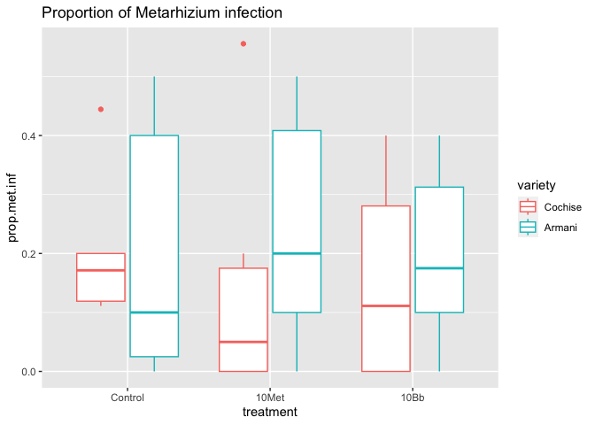
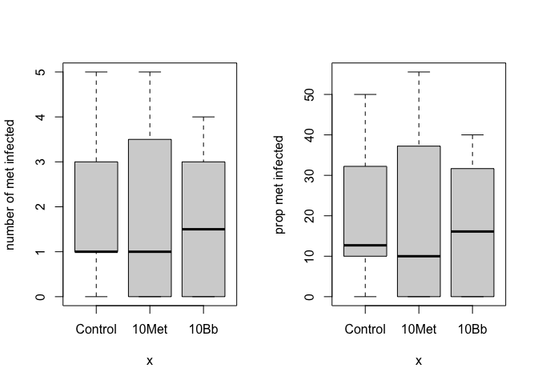

Fall 2022 Galleria field infection data
================
Morgan Swoboda
2023-02-09

# Package install and upload data sheet

``` r
#install.packages("emmeans")
#install.packages("ggthemes")

library(ggplot2)
library(emmeans)
library(tidyr)
library(dplyr)
```

    ## 
    ## Attaching package: 'dplyr'

    ## The following objects are masked from 'package:stats':
    ## 
    ##     filter, lag

    ## The following objects are masked from 'package:base':
    ## 
    ##     intersect, setdiff, setequal, union

``` r
library(ggthemes)
library(RColorBrewer)

#import data
Fall22EPF <- read.csv("Fall 22 epf bioassay - Sheet1.csv", )

#make treatments and varieties into factors
Fall22EPF$treatment = factor(Fall22EPF$treatment, levels = c("Control", "10Met", "10Bb"))
Fall22EPF$variety = factor(Fall22EPF$variety, levels = c("Cochise", "Armani"))
#Fall22EPF$num.dead = as.numeric(Fall22EPF$num.dead)
#Fall22EPF$num.pupae = as.numeric(Fall22EPF$num.pupae)
#Fall22EPF$total.out = as.numeric(Fall22EPF$total.out)
#Fall22EPF$num.met.infect = as.numeric(Fall22EPF$num.met.infect)
```

# Prelim data check

``` r
#histogram of the distribution of number of metarhizium infected insects
hist(Fall22EPF$num.met.infect)
```

<!-- -->

``` r
ggplot(data = Fall22EPF, aes(x = treatment, y = prop.met.inf, color = variety)) + geom_boxplot() + 
  ggtitle("Metarhizium infection")
```

<!-- -->

# Stats for Metarhizium - normal ANOVA way?

``` r
attach(Fall22EPF)

##two way ANOVA
two.way.Met <- aov(prop.met.inf~treatment*variety)
summary(two.way.Met) #no signifcant differences, no interaction, change to one way model instead?
```

    ##                   Df Sum Sq Mean Sq F value Pr(>F)
    ## treatment          2 0.0040 0.00198   0.055  0.947
    ## variety            1 0.0196 0.01962   0.543  0.467
    ## treatment:variety  2 0.0150 0.00748   0.207  0.814
    ## Residuals         30 1.0831 0.03610

``` r
summary.lm(two.way.Met)
```

    ## 
    ## Call:
    ## aov(formula = prop.met.inf ~ treatment * variety)
    ## 
    ## Residuals:
    ##     Min      1Q  Median      3Q     Max 
    ## -0.2407 -0.1426 -0.0746  0.1387  0.4130 
    ## 
    ## Coefficients:
    ##                               Estimate Std. Error t value Pr(>|t|)  
    ## (Intercept)                   0.201587   0.077571   2.599   0.0144 *
    ## treatment10Met               -0.058995   0.109702  -0.538   0.5947  
    ## treatment10Bb                -0.047884   0.109702  -0.436   0.6656  
    ## varietyArmani                -0.001587   0.109702  -0.014   0.9886  
    ## treatment10Met:varietyArmani  0.099735   0.155142   0.643   0.5252  
    ## treatment10Bb:varietyArmani   0.045106   0.155142   0.291   0.7733  
    ## ---
    ## Signif. codes:  0 '***' 0.001 '**' 0.01 '*' 0.05 '.' 0.1 ' ' 1
    ## 
    ## Residual standard error: 0.19 on 30 degrees of freedom
    ## Multiple R-squared:  0.03436,    Adjusted R-squared:  -0.1266 
    ## F-statistic: 0.2135 on 5 and 30 DF,  p-value: 0.9541

``` r
##one way anova
one.way.Met <- aov(prop.met.inf~treatment)
summary(one.way.Met) #not significant
```

    ##             Df Sum Sq Mean Sq F value Pr(>F)
    ## treatment    2  0.004 0.00198   0.058  0.943
    ## Residuals   33  1.118 0.03387

``` r
summary.lm(one.way.Met)
```

    ## 
    ## Call:
    ## aov(formula = prop.met.inf ~ treatment)
    ## 
    ## Residuals:
    ##      Min       1Q   Median       3Q      Max 
    ## -0.20079 -0.17546 -0.07546  0.13287  0.36389 
    ## 
    ## Coefficients:
    ##                 Estimate Std. Error t value Pr(>|t|)    
    ## (Intercept)     0.200794   0.053127   3.780 0.000626 ***
    ## treatment10Met -0.009127   0.075133  -0.121 0.904049    
    ## treatment10Bb  -0.025331   0.075133  -0.337 0.738142    
    ## ---
    ## Signif. codes:  0 '***' 0.001 '**' 0.01 '*' 0.05 '.' 0.1 ' ' 1
    ## 
    ## Residual standard error: 0.184 on 33 degrees of freedom
    ## Multiple R-squared:  0.003522,   Adjusted R-squared:  -0.05687 
    ## F-statistic: 0.05831 on 2 and 33 DF,  p-value: 0.9435

``` r
plot(one.way.Met) #probably not normal based on QQ plot, looks like it's exponential?
```

<!-- --><!-- --><!-- --><!-- -->

``` r
shapiro.test(resid(one.way.Met)) #residuals NOT normal
```

    ## 
    ##  Shapiro-Wilk normality test
    ## 
    ## data:  resid(one.way.Met)
    ## W = 0.88312, p-value = 0.001217

``` r
fligner.test(prop.met.inf~treatment) #normal
```

    ## 
    ##  Fligner-Killeen test of homogeneity of variances
    ## 
    ## data:  prop.met.inf by treatment
    ## Fligner-Killeen:med chi-squared = 0.5765, df = 2, p-value = 0.7496

``` r
#KW instead since it's not normal
##KW for met
MetF22KW <- kruskal.test(prop.met.inf~treatment)
print(MetF22KW) #not significant
```

    ## 
    ##  Kruskal-Wallis rank sum test
    ## 
    ## data:  prop.met.inf by treatment
    ## Kruskal-Wallis chi-squared = 0.35641, df = 2, p-value = 0.8368

``` r
#make some graphs
head(Fall22EPF)
```

    ##   pot.ID treatment variety num.dead num.pupae total.out num.infect
    ## 1    C+1   Control Cochise        5         2         7          1
    ## 2    C+2   Control Cochise       10         0        10          6
    ## 3    C+3   Control Cochise        9         0         9          6
    ## 4    C+4   Control Cochise        9         0         9          2
    ## 5    C+5   Control Cochise        9         0         9          2
    ## 6    C+6   Control Cochise        9         1        10          2
    ##   num.bb.infect num.met.infect prop.met.inf prop.bb.inf
    ## 1             0              1    0.1428571           0
    ## 2             0              2    0.2000000           0
    ## 3             0              4    0.4444444           0
    ## 4             0              1    0.1111111           0
    ## 5             0              1    0.1111111           0
    ## 6             0              2    0.2000000           0

``` r
plot(treatment, prop.met.inf, ylab = "proportion met infected", xlab("Treatment"))
```

<!-- -->

``` r
#nice plot
met.inf.F22 <- ggplot(data = Fall22EPF, aes(x = treatment, y = prop.met.inf, fill = treatment)) + 
  geom_bar(stat = "summary", fun = "mean", position = "dodge", color = "black") + 
  scale_fill_manual(values=c("#B31B1B", "#ddd3c2", "#221f1b")) +
  geom_errorbar(stat = "summary", fun.data = "mean_se", aes(x=treatment), position = "dodge", width = 0.5) + 
  ylab("Proportion of G. mellonella infected by M. anisopliae") + 
  theme_classic() + theme(text = element_text(size=15)) + 
  theme(legend.position = "none") + ggtitle("Fall 2022")

#centered the title and made an object
met.inf.F22 <- met.inf.F22 + theme(plot.title = element_text(hjust = 0.5))
met.inf.F22
```

<!-- -->

# Try a different type of analysis? X is categorical, Y is continuous/counts (but is a proportion)

# Try a GLM?

## can use a GLM when the variance is not constant, and/or when the errors are not normally distributed

### Might consider using GLMs when the response variable is: count data expressed as proportions, count data that are not proportions, binary response variables, data on time to death where the varience increases faster than linearly with the mean

``` r
names(Fall22EPF) 
```

    ##  [1] "pot.ID"         "treatment"      "variety"        "num.dead"      
    ##  [5] "num.pupae"      "total.out"      "num.infect"     "num.bb.infect" 
    ##  [9] "num.met.infect" "prop.met.inf"   "prop.bb.inf"

``` r
#num.dead is the number of galleria counted as dead, num.pupae is the number that pupated, total.out
#is the sum of num.dead and num.pupae, num.met.infect is the number of galleria that exhibited
#Metarhizium infections

#look at main effect means
tapply(num.met.infect, treatment, mean)
```

    ##  Control    10Met     10Bb 
    ## 1.833333 1.833333 1.666667

``` r
tapply(num.met.infect, variety, mean)
```

    ##  Cochise   Armani 
    ## 1.555556 2.000000

``` r
#check with error distribution works best with this data
library(MASS)
```

    ## 
    ## Attaching package: 'MASS'

    ## The following object is masked from 'package:dplyr':
    ## 
    ##     select

``` r
fit1 <- fitdistr(Fall22EPF$num.met.infect, "normal")
fit2 <- fitdistr(Fall22EPF$num.met.infect, "Poisson")
fit3 <- fitdistr(Fall22EPF$num.met.infect, "negative binomial")

#check the AIC of the three error distributions
AIC(fit1, fit2, fit3) #the smaller the AIC, the better fit. Negative binomial seems to be the best.
```

    ##      df      AIC
    ## fit1  2 142.2973
    ## fit2  1 134.5409
    ## fit3  2 131.9341

``` r
#glm model of interactions between treatment and variety - Poisson error distribution
glmintmodel <- glm(num.met.infect ~ treatment * variety, poisson)
summary(glmintmodel) #no interaction
```

    ## 
    ## Call:
    ## glm(formula = num.met.infect ~ treatment * variety, family = poisson)
    ## 
    ## Deviance Residuals: 
    ##     Min       1Q   Median       3Q      Max  
    ## -2.1603  -1.6330  -0.6741   0.8386   2.4257  
    ## 
    ## Coefficients:
    ##                                Estimate Std. Error z value Pr(>|z|)  
    ## (Intercept)                   6.061e-01  3.015e-01   2.010   0.0444 *
    ## treatment10Met               -3.185e-01  4.646e-01  -0.685   0.4931  
    ## treatment10Bb                -2.007e-01  4.495e-01  -0.446   0.6553  
    ## varietyArmani                 3.024e-10  4.264e-01   0.000   1.0000  
    ## treatment10Met:varietyArmani  5.596e-01  6.150e-01   0.910   0.3628  
    ## treatment10Bb:varietyArmani   2.007e-01  6.195e-01   0.324   0.7460  
    ## ---
    ## Signif. codes:  0 '***' 0.001 '**' 0.01 '*' 0.05 '.' 0.1 ' ' 1
    ## 
    ## (Dispersion parameter for poisson family taken to be 1)
    ## 
    ##     Null deviance: 63.726  on 35  degrees of freedom
    ## Residual deviance: 61.742  on 30  degrees of freedom
    ## AIC: 142.56
    ## 
    ## Number of Fisher Scoring iterations: 5

``` r
#glm model of interactions between treatment and variety - negative binomial
#error distribution


#R reports two forms of deviance – the null deviance and the residual deviance. The null deviance
#shows how well the response variable is predicted by a model that includes only the intercept
#(grand mean). It’s a measure of badness of fit–higher numbers indicate worse fit.  As a general
#rule of thumb, you should hope that your Residual deviance is not more than twice your degrees of
#freedom.

#The Akaike Information Criterion (AIC) provides a method for assessing the quality of your model 
#through comparison of related models.  It’s based on the Deviance, but penalizes you for making the
#model more complicated.  Much like adjusted R-squared, it’s intent is to prevent you from including
#irrelevant predictors. However, unlike adjusted R-squared, the number itself is not meaningful. If
#you have more than one similar candidate models (where all of the variables of the simpler model
#occur in the more complex models), then you should select the model that has the smallest AIC. So
#it’s useful for comparing models, but isn’t interpretable on its own.

model2 <-  glm(num.met.infect ~ treatment, poisson)
summary(model2)
```

    ## 
    ## Call:
    ## glm(formula = num.met.infect ~ treatment, family = poisson)
    ## 
    ## Deviance Residuals: 
    ##     Min       1Q   Median       3Q      Max  
    ## -1.9148  -1.8257  -0.6162   0.9274   1.9235  
    ## 
    ## Coefficients:
    ##                  Estimate Std. Error z value Pr(>|z|)   
    ## (Intercept)     6.061e-01  2.132e-01   2.843  0.00447 **
    ## treatment10Met  1.118e-10  3.015e-01   0.000  1.00000   
    ## treatment10Bb  -9.531e-02  3.090e-01  -0.308  0.75771   
    ## ---
    ## Signif. codes:  0 '***' 0.001 '**' 0.01 '*' 0.05 '.' 0.1 ' ' 1
    ## 
    ## (Dispersion parameter for poisson family taken to be 1)
    ## 
    ##     Null deviance: 63.726  on 35  degrees of freedom
    ## Residual deviance: 63.600  on 33  degrees of freedom
    ## AIC: 138.41
    ## 
    ## Number of Fisher Scoring iterations: 5

``` r
#see how the models compare to each other using an anova
anova(glmintmodel,model2, test = "Chi") #not significantly different, so we're ok using the model2?
```

    ## Analysis of Deviance Table
    ## 
    ## Model 1: num.met.infect ~ treatment * variety
    ## Model 2: num.met.infect ~ treatment
    ##   Resid. Df Resid. Dev Df Deviance Pr(>Chi)
    ## 1        30     61.742                     
    ## 2        33     63.600 -3  -1.8576   0.6025

``` r
# Ashley suggested to keep the variety interaction even though it's not significant

#test the model that you think fits best with the Hosmer Lemeshow goodness of fit test.
# install.packages("ResourceSelection") #need this package for the hoslem.test() function.
library(ResourceSelection)
```

    ## ResourceSelection 0.3-5   2019-07-22

``` r
hoslem.test(Fall22EPF$num.met.infect, fitted(model2))
```

    ## 
    ##  Hosmer and Lemeshow goodness of fit (GOF) test
    ## 
    ## data:  Fall22EPF$num.met.infect, fitted(model2)
    ## X-squared = -3.3327e-19, df = 8, p-value = 1

# Plot the GLM model
